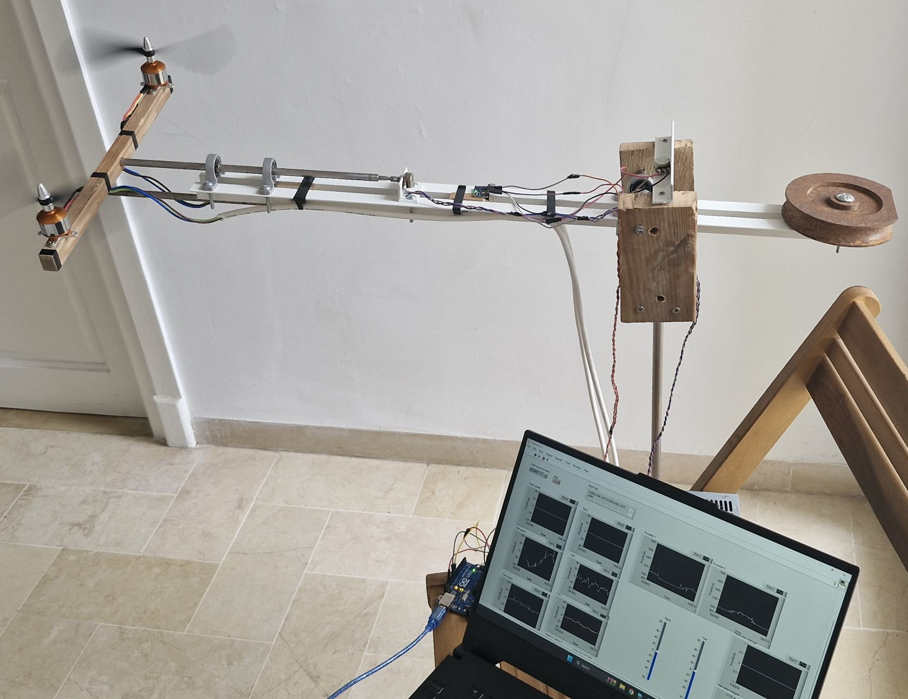
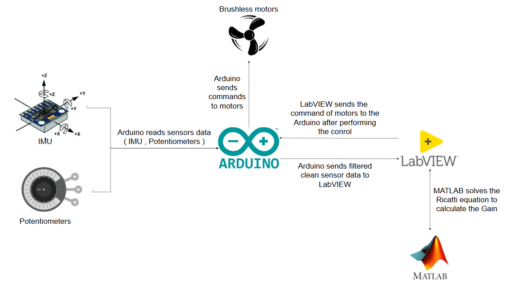

# 3-DOF VTOL Helicopter Rig — LQR-I Control System

**Full-stack implementation of a 3-degree-of-freedom (3-DOF) VTOL helicopter rig, controlled by a Linear Quadratic Regulator with integral action (LQR-I). Developed as a project for the Nonlinear Control Systems class at INSAT, class IIA4.**

---

## Table of Contents

1. [Project Overview](#1-project-overview)
2. [System Architecture](#2-system-architecture)
3. [Physical Setup and Hardware](#3-physical-setup-and-hardware)
4. [Mathematical Modeling](#4-mathematical-modeling)
5. [State-Space Representation and Linearization](#5-state-space-representation-and-linearization)
6. [LQR-I Controller Design](#6-lqr-i-controller-design)
7. [Sensor Suite and Signal Processing](#7-sensor-suite-and-signal-processing)
8. [Arduino Firmware](#8-arduino-firmware)
9. [LabVIEW Supervisory Interface](#9-labview-supervisory-interface)
10. [Results and Performance](#10-results-and-performance)
11. [Repository Structure](#11-repository-structure)
12. [Team](#12-team)

---

## 1. Project Overview

This project implements a laboratory-scale Vertical Take-Off and Landing (VTOL) rig capable of actively stabilizing itself across three mechanical degrees of freedom: **Elevation (e)**, **Roll (θ)**, and **Yaw (Ψ)**. The rig is derived from the classical VTOL benchmark problem but adapted into a physically constrained 3-DOF helicopter rig for safe laboratory testing.

The control objective is to regulate elevation, roll, and yaw to desired setpoints in the presence of external disturbances, while rejecting steady-state errors through integral augmentation of the state-feedback law.

**Key features:**

- Nonlinear 3-DOF coupled dynamics with strong input coupling (ε = 0.2)
- Linearized state-space model around the hovering equilibrium
- Augmented LQR-I controller (8 states: 6 physical + 2 integrators) designed in MATLAB
- Real-time control loop executing at 100 Hz on an Arduino microcontroller
- GY-85 IMU (ADXL345 accelerometer + ITG-3205 gyroscope) for elevation angle and rate sensing
- Two analog potentiometers for mechanical angle feedback (roll and yaw)
- Dual brushless motor actuators driven through calibrated ESCs
- LabVIEW supervisory VI for real-time telemetry, command injection, and gain scheduling over serial

---

### Physical Model

> 📷 **Photo of the physical rig**
>
> 
>
> *The assembled 3-DOF VTOL rig: aluminum + wood arm mounted on a central pivot, with two brushless motors and the GY-85 IMU module.*

---

### System Overview

> 📐 **System architecture diagram**
>
> 
>
> *Block diagram showing the closed-loop pipeline: sensors → Arduino → serial → LabVIEW LQR-I controller → ESC commands → actuators.*

---

### Demo Video

> 🎬 **Live demonstration**
>
> [](docs/media/demo_video.mp4)
>
> The demo showcases the rig stabilizing from a perturbed initial condition, tracking elevation and yaw setpoints in real-time while rejecting roll disturbances — all driven by the closed-loop LQR-I controller running across the Arduino–LabVIEW pipeline.

---

## 2. System Architecture

```
┌─────────────────────────────────────────────────────────────────────┐
│                         LabVIEW Host (PC)                           │
│  - Real-time data visualization (e, θ, Ψ and their rates)          │
│  - Setpoint injection                                               │
│  - ESC command transmission over VISA serial (230400 baud)          │
└────────────────────────────┬────────────────────────────────────────┘
                             │ USB / Serial (230400 baud)
                             ▼
┌─────────────────────────────────────────────────────────────────────┐
│                    Arduino Uno                                       │
│  - 100 Hz control loop (10 ms period)                               │
│  - Reads IMU (I2C: ADXL345 + ITG-3205)                              │
│  - Reads potentiometers (ADC A0, A1)                                │
│  - Applies low-pass filtering on angular velocities                 │
│  - Sends state vector upstream                                      │
│  - Receives ESC commands from LabVIEW                               │
└──────────┬─────────────────────────┬───────────────────────────────┘
           │ PWM (pin 9)             │ PWM (pin 10)
           ▼                         ▼
      ESC 1 → Motor M1         ESC 2 → Motor M2
      (Thrust + Roll)          (Thrust − Roll)
```

The control law itself (the LQR-I gain matrix K) is computed offline in MATLAB and executed on the LabVIEW host, which closes the loop by sending computed PWM commands back to the Arduino. The Arduino's role is therefore pure I/O: sensor acquisition, signal conditioning, and actuator driving.

---

## 3. Physical Setup and Hardware

### Mechanical Structure

The rig consists of a rigid arm of length **l = 0.56 m** mounted on a central pivot that allows rotation in all three axes. Two brushless motors are mounted symmetrically at a lateral arm span of **d = 0.14 m** from the central axis. The mechanical pivot imposes physical constraints that make the system safe to test in a laboratory while preserving the essential nonlinear coupled dynamics of a free-flying VTOL.

### Inertial Parameters

| Parameter | Symbol | Value | Unit |
|-----------|--------|-------|------|
| Arm length | l | 0.56 | m |
| Motor lateral offset | d | 0.14 | m |
| Total mass | m | 0.03 | kg |
| Yaw moment of inertia | J_ψ | 0.23 | kg·m² |
| Elevation moment of inertia | J_e | 0.21 | kg·m² |
| Roll moment of inertia | J_θ | 0.0032 | kg·m² |
| Input coupling coefficient | ε | 0.2 | — |
| Hover thrust (u₀ = mg) | u₀ | 0.2943 | N |

### Hardware Bill of Materials

| Component | Role |
|-----------|------|
| Arduino Uno | Embedded controller, sensor hub, ESC driver |
| GY-85 IMU (ADXL345 + ITG-3205, I2C) | 3-axis accelerometer + gyroscope — elevation angle, elevation rate, and angular rates |
| 2× Analog potentiometer | Roll angle (A0) and yaw angle (A1) |
| 2× Brushless motor + ESC | Actuators — M1 (pin 9), M2 (pin 10) |
| Various inexpensive hardware (wood + aluminum + screws) | Mechanical frame and pivot structure |
| Dedicated power supply | Motor power rail, isolated from logic |
| PC running LabVIEW | Supervisory control, real-time visualization |

---

## 4. Mathematical Modeling

### Original VTOL Benchmark (Free-Flying)

The classical VTOL problem describes a planar aircraft with mass m and inertia normalized to 1:

```
ẍ =  −u·sin(θ) + ε·v·cos(θ)
z̈ =   u·cos(θ) + ε·v·sin(θ) − g
θ̈ =   v
```

Where **u** is the primary lift thrust, **v** is the torque input producing roll, and ε ≠ 0 captures the strong input coupling: the torque channel also produces a lateral parasitic force along the body axis.

### Transition to the 3-DOF Helicopter Rig Model

The free-flying model is impractical to implement safely in a laboratory. The team transitioned to the **3-DOF Helicopter Rig** model, which introduces a mechanical pivot and maps the dynamics onto the physically measurable axes: Elevation (e), Roll (θ), and Yaw (Ψ).

The nonlinear equations of motion are:

```
J_e · ë  =  l·(u·cos θ + ε·v·sin θ) − mgl·cos e
J_θ · θ̈  =  d·v
J_ψ · ψ̈  =  l·(u·sin θ + ε·v·cos θ)·cos e
```

Where:
- **u = F₁ + F₂** is the collective thrust input (sum of both motor forces)
- **v = F₁ − F₂** is the differential thrust input (difference producing roll torque)
- The ε·v·sin θ term in the elevation equation captures the parasitic coupling from the roll channel into the elevation axis

---

## 5. State-Space Representation and Linearization

The system is linearized around the hovering equilibrium point:

```
e = 0,  θ = 0,  Ψ = 0,  ė = 0,  θ̇ = 0,  Ψ̇ = 0
u₀ = mg  (hover thrust)
```

The resulting 6-state linear model is:

**State vector:** x = [e, θ, Ψ, ė, θ̇, Ψ̇]ᵀ

**System matrix A (6×6):**

```
A = [ 0      0           0   1  0  0 ]
    [ 0      0           0   0  1  0 ]
    [ 0      0           0   0  0  1 ]
    [ 0      0           0   0  0  0 ]
    [ 0      0           0   0  0  0 ]
    [ 0   l·u₀/J_ψ      0   0  0  0 ]
```

**Input matrix B (6×2):**

```
B = [ 0          0        ]
    [ 0          0        ]
    [ 0          0        ]
    [ l/J_e      0        ]
    [ 0          d/J_θ    ]
    [ 0       l·ε/J_ψ     ]
```

**Input vector:** τ = [u, v]ᵀ = [F₁+F₂, F₁−F₂]ᵀ

The non-zero entry A[5,1] = l·u₀/J_ψ is the linearized coupling between roll angle θ and yaw acceleration Ψ̈, which arises from the geometry of the rig at the hover operating point.

---

## 6. LQR-I Controller Design

### Integral Augmentation

A pure LQR regulator guarantees asymptotic stability but does not eliminate steady-state error in the presence of constant disturbances or model mismatch. To achieve zero steady-state error on the two primary position outputs — **elevation (e)** and **yaw (Ψ)** — the state vector is augmented with their time integrals.

**Output matrix for integration:**

```
C_int = [ 1  0  0  0  0  0 ]   (integrates elevation e)
        [ 0  0  1  0  0  0 ]   (integrates yaw Ψ)
```

**Augmented system (8×8):**

```
A_aug = [ A        0₆ₓ₂  ]       B_aug = [ B      ]
        [ −C_int   0₂ₓ₂  ]               [ 0₂ₓ₂  ]
```

The augmented state vector is: x_aug = [e, θ, Ψ, ė, θ̇, Ψ̇, ∫e, ∫Ψ]ᵀ

### Controllability Verification

Before solving the Riccati equation, the controllability of the augmented system is verified:

```matlab
Co_aug = ctrb(A_aug, B_aug);
rank(Co_aug)  % Must equal 8
```

The rank equals 8, confirming full controllability of the augmented 8-state system.

### Cost Function and Weight Selection

The LQR minimizes the infinite-horizon quadratic cost:

```
J = ∫₀^∞ (xᵀQx + uᵀRu) dt
```

The weight matrices were tuned iteratively through simulation:

**Q = diag([100, 300, 150, 1, 100, 5, 30, 20])**

| State | Weight | Rationale |
|-------|--------|-----------|
| e (elevation) | 100 | Moderate regulation — elevation drifts slowly |
| θ (roll) | 300 | High — roll instability propagates quickly to yaw |
| Ψ (yaw) | 150 | High — primary position output |
| ė | 1 | Low — velocity damping left to natural dynamics |
| θ̇ | 100 | High — roll rate must be damped aggressively |
| Ψ̇ | 5 | Moderate |
| ∫e | 30 | Integral action on elevation |
| ∫Ψ | 20 | Integral action on yaw |

**R = diag([300, 300])** — equal penalty on collective and differential thrust inputs, limiting motor saturation.

### Optimal Gain Matrix

Solving the algebraic Riccati equation in MATLAB:

```matlab
[K, S, e] = lqr(A_aug, B_aug, Q, R);
```

yields the optimal gain matrix:

```
K = [ 0.9287    0        0       0.8366   0       0       −0.3162    0      ]
    [ 0         1.7954   1.3396  0        0.6171  2.5070   0        −0.2582 ]
```

**Row 1** drives the collective thrust u: regulated primarily by elevation (e) and its integral, with a negative gain on ∫Ψ providing cross-channel decoupling.

**Row 2** drives the differential thrust v: regulated by roll (θ), yaw (Ψ), their rates, and the yaw integral.

The control law implemented in LabVIEW is:

```
τ = −K · x_aug
u = τ[0] + u₀      (add hover thrust offset)
v = τ[1]
F₁ = (u + v) / 2
F₂ = (u − v) / 2
```

---

## 7. Sensor Suite and Signal Processing

### IMU: GY-85 (ADXL345 + ITG-3205)

Both sensors communicate over I2C at 400 kHz. The ADXL345 provides 3-axis acceleration from which the elevation (pitch) angle is computed:

```
e = atan2(−ax, sqrt(ay² + az²)) − e_offset
```

The ITG-3205 provides the Y-axis angular rate, which after bias subtraction gives the elevation rate ė = gy.

### Potentiometers

The two potentiometers are mechanically linked to the pivot structure. Their ADC readings (10-bit, 0–1023) are scaled to radians:

```
ADC_SCALE = (3π/2) / 1024 = 4.7123 / 1024  [rad/LSB]
roll  = analogRead(A0) × ADC_SCALE − roll_offset
yaw   = analogRead(A1) × ADC_SCALE − yaw_offset
```

### Calibration

At startup, 100 samples are averaged to establish bias offsets for all sensors:

```cpp
pitchOffset = mean(atan2(−ax, sqrt(ay²+az²)))
rollOffset  = mean(analogRead(A0) × ADC_SCALE)
yawOffset   = mean(analogRead(A1) × ADC_SCALE)
gxOffset    = mean(rawGX)
gyOffset    = mean(rawGY)
```

### Velocity Estimation and Low-Pass Filtering

Roll rate and yaw rate are estimated by finite differences of the potentiometer readings with a first-order low-pass filter to reduce ADC quantization noise:

```
dRoll = currentRoll − lastRoll
filteredRollSpeed = α × (dRoll / dt) + (1−α) × filteredRollSpeed
```

with α = 0.15 (LP_ALPHA). A deadband of ±0.002 rad is applied before the filter to suppress noise-induced drift:

```
if |dRoll| > DEADBAND:
    update filter
else:
    filteredRollSpeed × 0.9   (passive decay)
```

### Serial Telemetry Protocol

The Arduino transmits the full 6-element state vector at 100 Hz over serial at 230400 baud:

```
−pitch, roll, −yaw, gy, filteredRollSpeed, −filteredYawSpeed\n
```

And receives ESC commands from LabVIEW:

```
<ESC1_microseconds>,<ESC2_microseconds>\n
```

Both values are hardware-constrained to [ESC_MIN=1000, ESC_MAX=1700] µs.

---

## 8. Arduino Firmware

**File:** `firmware/FinalFinal.ino`

### Control Loop

The loop runs at a **target period of 10 ms (100 Hz)**, gated by a microsecond timer:

```cpp
if (currentMicros - lastMicros >= 10000) {
    // sensor read → state estimation → serial TX
    // serial RX → ESC write
}
```

### ESC Initialization Sequence

On startup, the ESCs undergo a mandatory calibration sequence:

```
1. Attach servos to PWM pins 9 and 10
2. Write ESC_MAX (1700 µs) for 3 seconds  → arm at full throttle
3. Write ESC_MIN (1000 µs) for 3 seconds  → confirm minimum throttle
4. System ready
```

### Performance Optimizations

The firmware includes several microcontroller-specific optimizations to meet the 10 ms budget:

- **Pre-inverted constants**: `GYRO_SCALE = 1.0 / 14.375` — multiplication replaces division in the hot path
- **Pre-computed ADC scale**: `ADC_SCALE = 4.7123 / 1024.0` — single multiply per sample
- **Float math intrinsics**: `atan2f`, `sqrtf` — use AVR single-precision hardware where available
- **Inline I2C write**: `writeTo()` declared `inline` to eliminate function call overhead
- **Removed unused offset**: `gzOffset` was computed but never used; removed to save stack and computation
- **Baud rate 230400**: High baud rate minimizes serial blocking time at 100 Hz data rate

### Firmware Dependencies

```
Servo.h   — standard Arduino servo/ESC PWM library
Wire.h    — I2C communication
math.h    — atan2f, sqrtf
```

---

## 9. LabVIEW Supervisory Interface

**File:** `labview/FinalFinal.vi`

The LabVIEW VI serves as the **real-time supervisory controller and human-machine interface**. It connects to the Arduino over a VISA serial port (configurable COM port, 230400 baud).

**Functions implemented in the VI:**

- **Serial acquisition**: Reads the 6-element CSV state vector from the Arduino at 100 Hz
- **State parsing**: Splits the comma-delimited string and converts fields to numeric arrays
- **LQR-I control law**: Implements `τ = −K × x_aug` using the NI matrix multiply VI (`A x B.vi`, `A x Vector.vi` from `baseanly.llb`)
- **Integral accumulation**: Maintains running integrals of elevation and yaw errors
- **Setpoint management**: Allows the operator to inject reference values for e, θ, Ψ
- **ESC command generation**: Converts computed forces F₁, F₂ to PWM microsecond values and transmits `<esc1>,<esc2>\n` back to the Arduino
- **Real-time charts**: Waveform graphs for all 6 state signals and both control outputs
- **Safety limits**: ESC outputs are clamped to [1000, 1700] µs before transmission

---

## 10. Results and Performance

The LQR-I controller successfully stabilizes the rig across all three axes. Key observations:

- **Elevation regulation**: The system reaches the target elevation and holds it with zero steady-state error, demonstrating the effect of the integral state on ∫e.
- **Yaw regulation**: Yaw is brought to the desired heading and maintained; the integral term on ∫Ψ eliminates the constant bias introduced by motor asymmetries.
- **Roll stabilization**: Roll is stabilized without a dedicated integrator, relying on the high Q weight (300) on θ and active rate feedback (Q = 100 on θ̇).
- **Disturbance rejection**: Manual disturbances applied to the rig structure are rejected within approximately 2–3 seconds.
- **Cross-axis coupling**: The non-zero ε = 0.2 coupling coefficient introduces observable cross-axis effects (roll inputs perturbing yaw), which the LQR-I handles through the off-diagonal terms of K row 2.

---

## 11. Repository Structure

```
vtol-lqr-helicopter-rig/
│
├── README.md                          # This document
│
├── firmware/
│   └── FinalFinal.ino                 # Arduino firmware (sensor acquisition, ESC control)
│
├── control/
│   └── LQRI.m                         # MATLAB: system matrices, LQR-I design, K export
│
├── labview/
│   └── FinalFinal.vi                  # LabVIEW VI: supervisory control, visualization
│
└── docs/
    ├── vtol_presentation.pdf          # Project presentation slides
    └── media/
        ├── model_photo.png            # Photo of the physical rig
        ├── system_overview.png        # System architecture diagram
        ├── demo_thumbnail.jpg         # Video thumbnail
        └── demo_video.mp4             # Live demonstration video
```

---

## 12. Team

**IIA4 — Final Year Engineering Project**

| Name | Role |
|------|------|
| Grati Elyes | Control design, MATLAB modeling |
| Njeh Oussema | Arduino firmware, embedded systems |
| Snoun Ferid | LabVIEW interface, system integration |
| Khelil Souheib | Hardware, mechanical design, testing |

---

## License

This project is released for academic and educational purposes.
